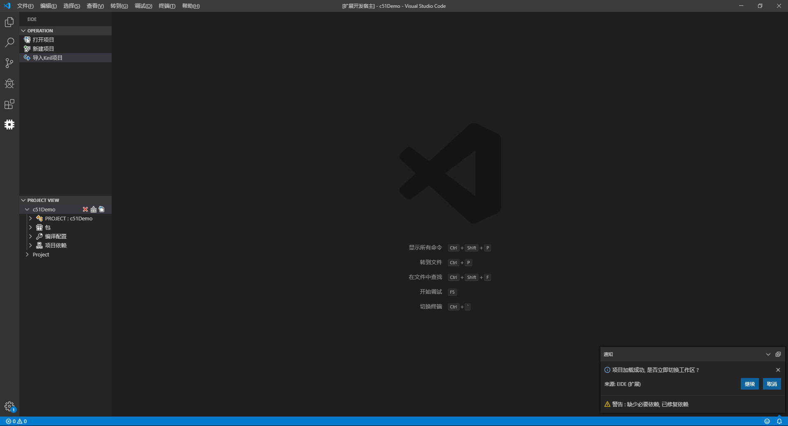

# EIDE

###[Jump to english readme](https://github.com/github0null/eide/blob/master/README_EN.md)

## 概要

一个轻量级的 STM32, C51 IDE, 可以方便的在 vscode 上对 C51, STM32 项目进行 开发,管理, 并且支持 Keil uVision 5 项目的导入和导出 **仅用于Windows平台**

***

## 功能

* 打开 EIDE 项目
* 创建 EIDE 项目
* 导入 Keil uVision 5 项目并完成 EIDE 项目的创建
* 导出 Keil 项目文件(.uvprojx, .uvproj)到工作区
* 管理项目依赖
* 编译项目 (如果为 STM32 项目, 还会生成与调试器 stm32-debugger 相关的 launch.json)
* `如果需要 STM32 调试功能, 可以在扩展商店搜索 stm32-debugger, 它与 EIDE 结合将会有更好的体验`

***

## 注意事项
  + **插件的安装路径中不应该存在中文, 否则在使用 编译功能 时可能会导致失败**
  + **不支持 C51 的调试功能**

***

## 功能展示

* **在使用所有功能之前必须先解压工具** 

***

* **导入 Keil uVision 5 项目** 

***

* **项目示例** 

***

* **您可以选择为STM32项目安装 keil ARM 包 (安装 Keil ARM 包不是必须的)** 

***

* **您可以选择为项目安装ARM包中的依赖** 

***

* **编译项目** 

***

* **开始调试 (使用 stm32-debugger)** 