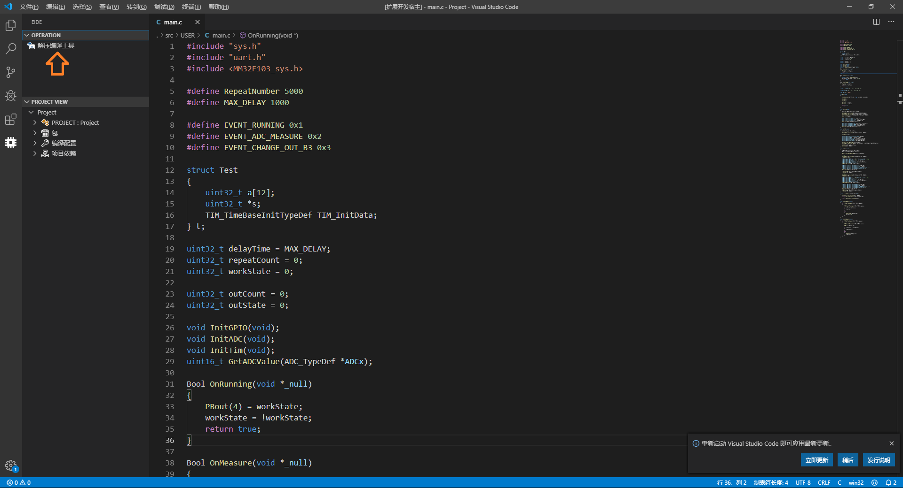
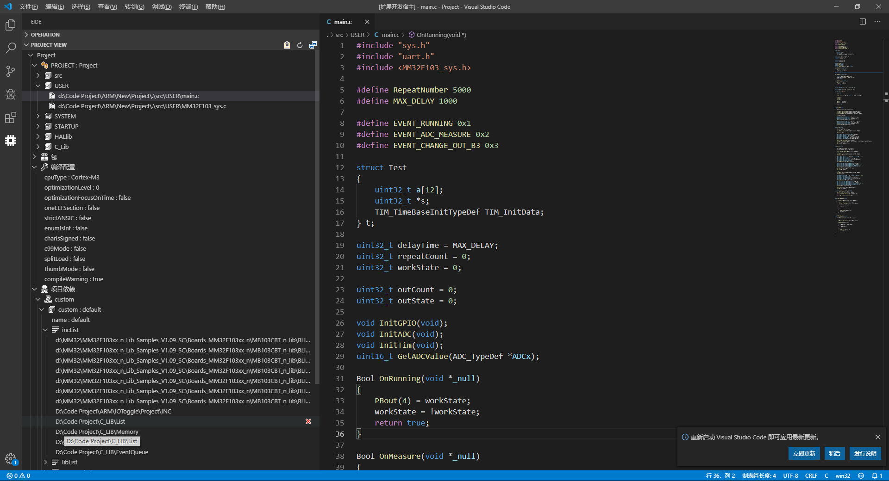
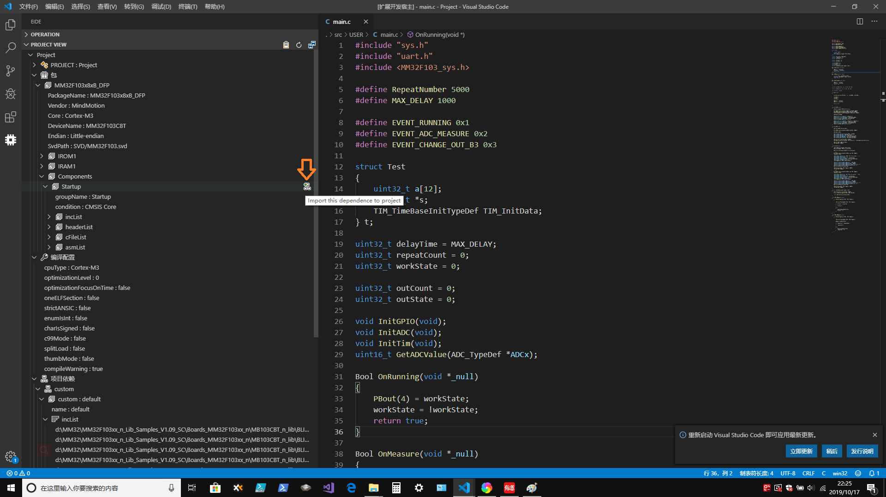

# EIDE

### [Jump to english readme](https://github.com/github0null/eide/blob/master/README_EN.md)

## 简述

一个 **STM32**, **C51** IDE, 可以方便的在 vscode 上对 C51, STM32 项目进行 开发, 管理, 并且支持 Keil uVision 5 项目的导入和导出 

- **仅用于Windows平台**

***

## 安装

因插件较大(大概 44 MB)，如果安装较慢，可在 [github -> release](https://github.com/github0null/eide/releases) 中下载最新版本 **vsix** 包

***

## 功能

* 打开 EIDE 项目
* 创建 EIDE 项目
* 导入 Keil uVision 5 项目并完成 EIDE 项目的创建 (对 Keil uVision 4, 5 支持较好)
* 导出 Keil 项目文件(.uvprojx, .uvproj)到工作区
* 管理项目依赖
* 编译项目 (如果为 STM32 项目, 还会生成与调试器 stm32-debugger 相关的 launch.json)
* `如果需要 STM32 调试功能, 可以在扩展商店搜索` [stm32-debugger](https://github.com/github0null/stm32-debugger/releases)`, 它与 EIDE 结合将会有更好的体验`

***

## 注意事项
  + **插件的安装路径中不应该存在中文, 否则在使用 编译功能 时可能会导致失败**
  + **不支持 C51 的调试功能 后续将会增加**
  + **导入功能: 对于过低版本的 Keil uVision 项目可能会导入失败**
  + **导出的 Keil uVision 项目文件只含有基本的`项目结构`,`头文件依赖`和`宏定义包含`, 并不具备详细的 Keil 项目配置, 因此用 Keil 打开后需要进一步进行配置**

***

## 功能展示

#### 在使用所有功能之前必须先解压工具

***

#### 打开项目

***

#### 新建项目

***

#### 导入 Keil uVison 5 项目

***

#### 导出 Keil uVison 5 XML

***

#### 项目示例

***

#### 编译项目

***

#### 您可以选择为 STM32 项目安装 keil ARM 包 (安装 Keil ARM 包不是必须的)

***

#### 您可以选择为项目安装 ARM 包中的依赖

***

#### 开始调试 (使用 stm32-debugger)

