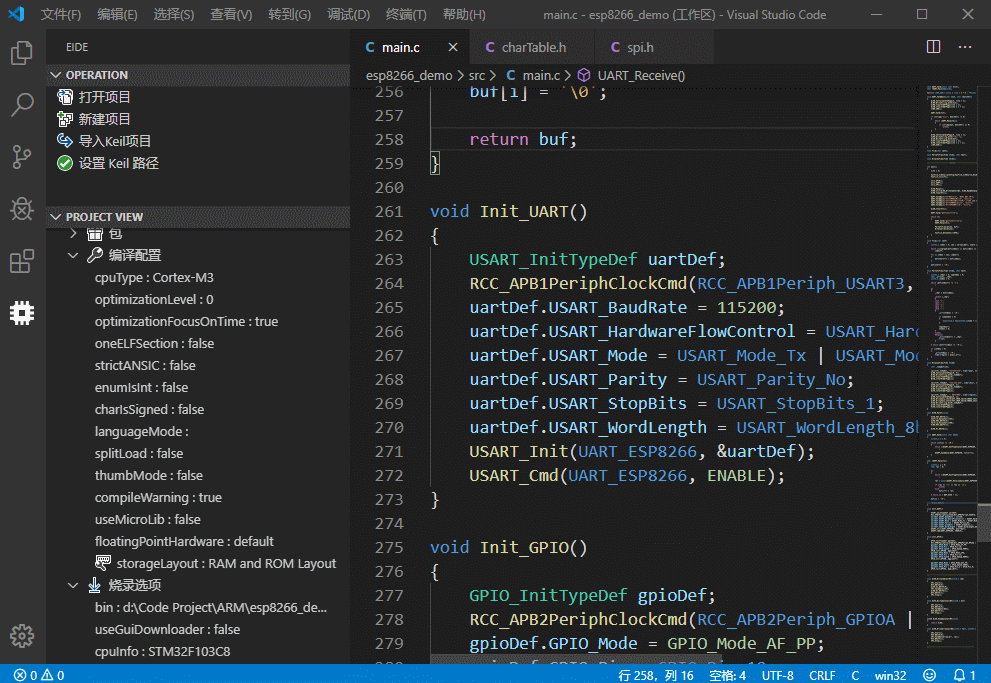
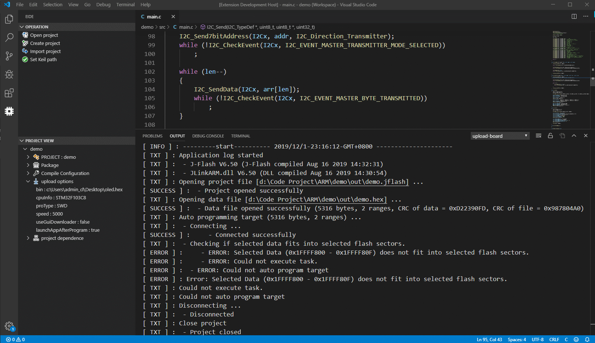
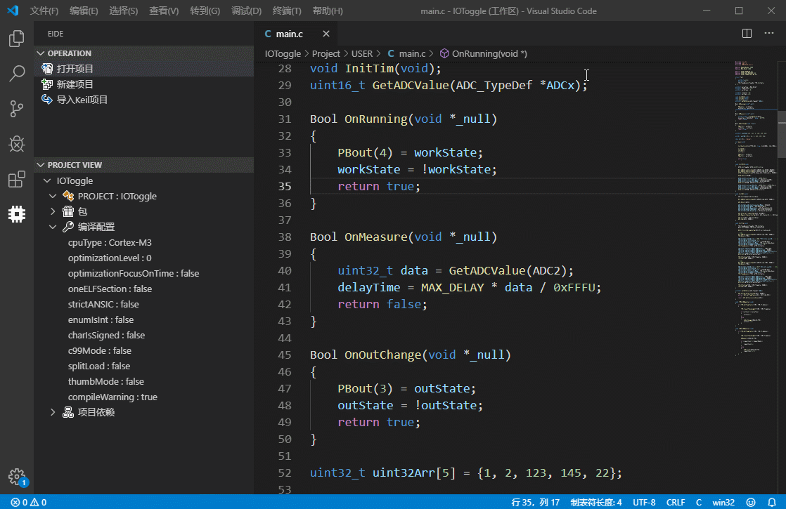
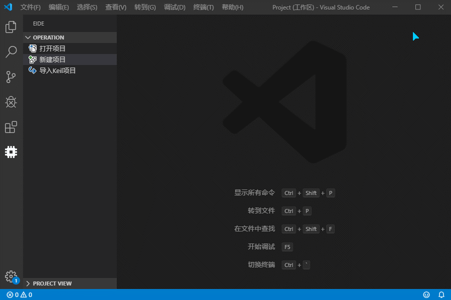
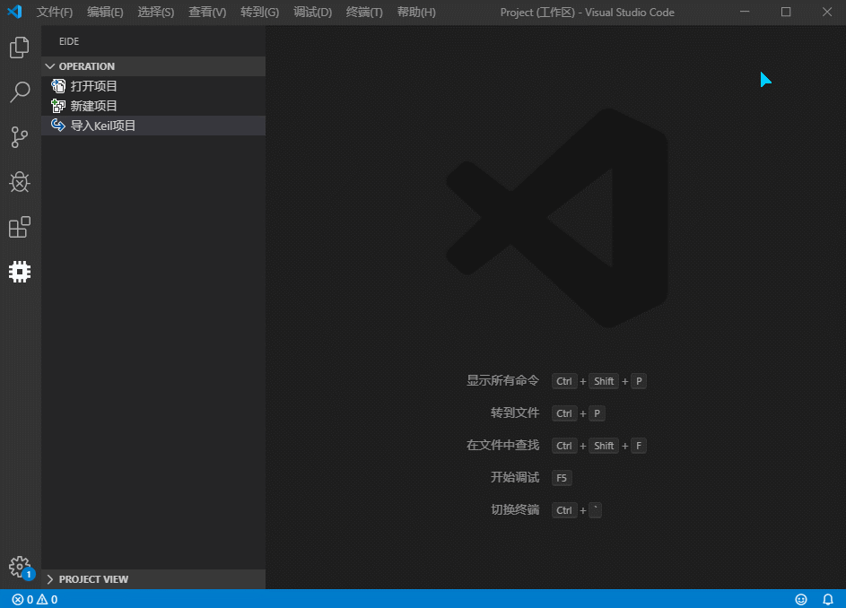
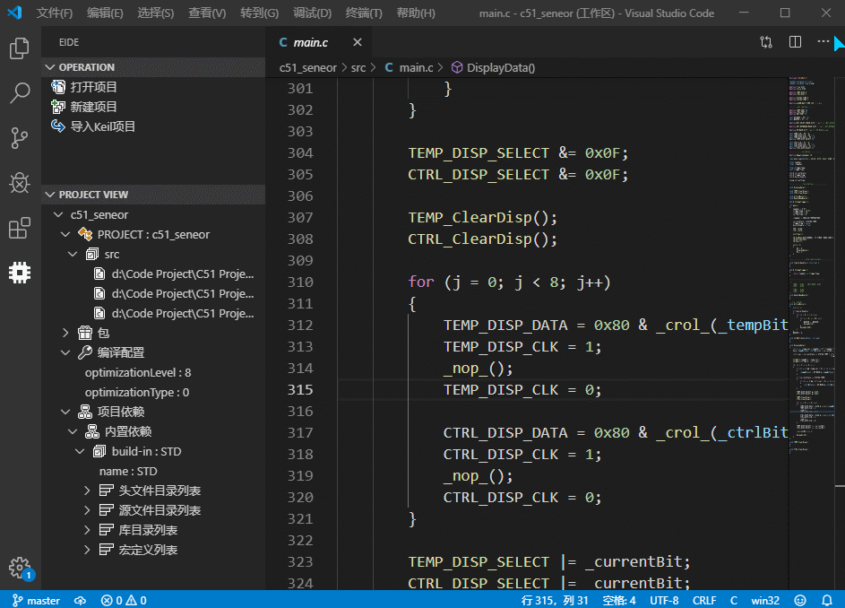
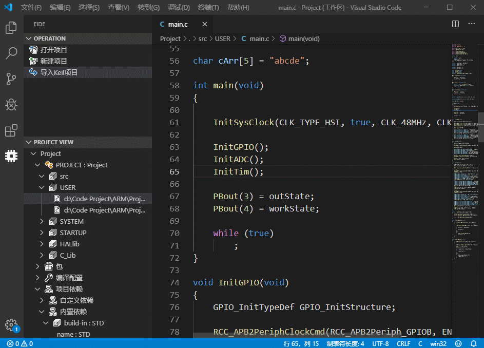
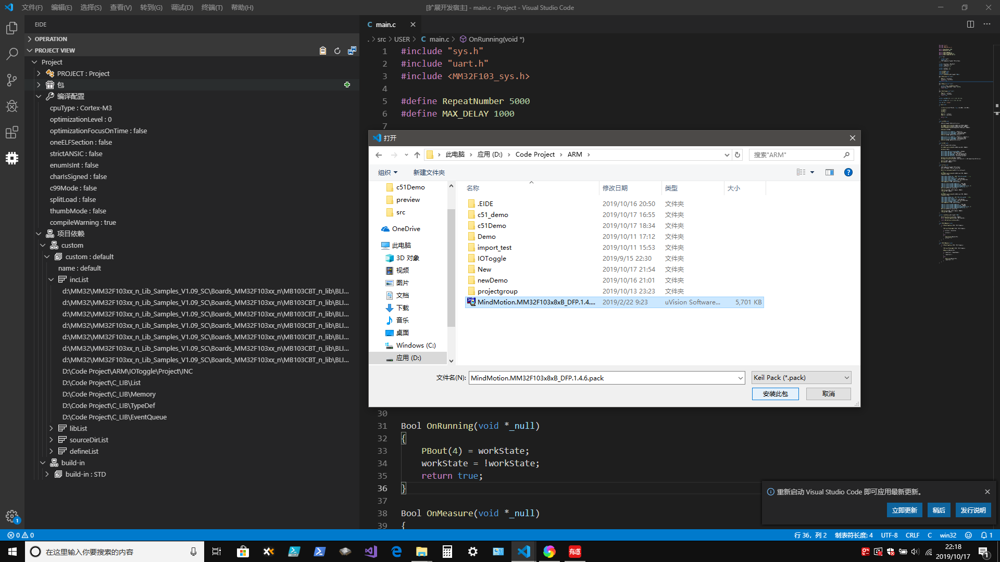
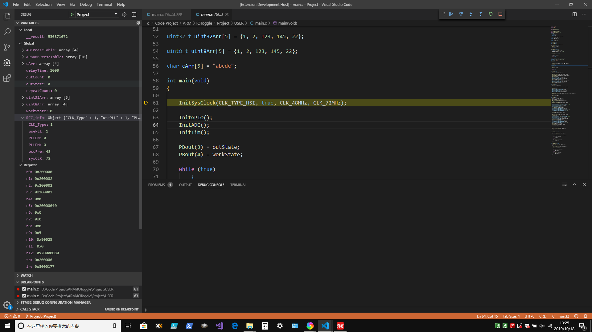

# EIDE

### [Jump to english readme](https://github.com/github0null/eide/blob/master/README_EN.md)

## 简述

一个 **STM32**, **C51** IDE, 可以方便的在 vscode 上对 C51, STM32 项目进行 开发, 管理, 并且支持 Keil uVision 5 项目的导入和导出 

### **仅支持于 Windows 平台**

***

## 安装

在扩展商店搜索 eide 或者 在 [github -> release](https://github.com/github0null/eide/releases) 中下载最新版本 **vsix** 包

***

## 版本变化

> #### 因作者的测试环境有限, 因此如果遇到了 bug, 欢迎大家通过 [Github -> issue](https://github.com/github0null/eide/issues) 进行反馈

> #### 注意: 使用 JLink 工具前请确保电脑已安装 jlink 驱动程序

> #### 作者正在编写一个简单的 [使用手册和注意事项](https://github.com/github0null/eide/blob/master/manual.md)，这将帮助大家更方便的使用该插件

- ### [v1.1.1]
- 修复: 无法自动创建 dependence 目录的问题
- 增加: 对 LIB 文件的链接, 可通过点击`添加LIB`按钮 或者 手动复制 LIB 文件到源文件目录完成 LIB 的添加

***

- ### [v1.1.0]
- 修复: 项目打开后 RTE_Components.h 的内容被删除的问题
- 更改: 更换已安装的 Component 的图标
- 更改: 删除无用的 STD dependence

***

- ### [v1.0.9]
- 修复: C51宏定义不全导致编译失败的问题

***

- ### [v1.0.8]
- 修复: ARM构建工具导致的乱码问题
- 修复: C51 编译参数过少的问题
- 修复: 无法创建 dependence 目录的问题

***
 
- ### [v1.0.7]
- 更改: 将 RAM 和 ROM 布局选项转到到一个单独的本地的 Web 页面

- 增加: 自动生成 “RTE_Components.h” 文件，以及自动更改，可使用插件设置 AutoGenerateRTE_Components 禁用，默认开启
- 增加: 默认的 GNU extensions 选项
- 增加: AutoGenerateRTE_Components 插件设置
- 增加: useMicroLib 选项
- 增加: 硬件浮点选项（只对于 cortex-M4 以及 cortex-M7 有效）

- 修复: C51 增加的宏没有参与编译过程的问题
- 修复: 安装 F4, F7 pack 包失败的问题
- 修复: 导出时 Keil 项目文件被覆盖的问题
- 修复: 使用'修复依赖'功能时删除了其他文件的问题

- 其他: 强化依赖导入的准确性，去除不必要的文件
- 其他: 自动删除包的不必要的部分以减小项目体积

***

- ### [v1.0.6]
- 修复没有找到 "core_cm.h" 头文件的问题
- 修复在导入 Keil 项目时, 头文件没有复制的问题
- 增加对 Keil 路径的验证
- 为 C51 项目加入了编译模式设置（用以支持更大 RAM 和 ROM 的 8051 芯片）和去除未使用的函数的选项（用以减小 代码 体积）

****

- ### [v1.0.5]
- 加入 JLink 烧录器, 支持一键烧录，暂不支持 C51
- 增加快捷键: <kbd>F6</kbd>编译 <kbd>F7</kbd>烧录 <kbd>Ctrl</kbd>+<kbd>F1</kbd>上传 eide 日志
- 优化了日志程序，方便上传应用日志，帮助改进此插件
- 修复部分问题
- 烧录功能展示 

****

- ### [v1.0.4]
- 优化重复的路径
- 修复了中文路径问题
- 修复了一些其他问题

****

- ### [v1.0.3]

- 由于许可证问题，这个版本移除了自带的 Keil 编译工具, 安装包大大缩小, 因此如果需要使用编译功能，则需要安装 Keil 并在此软件内设置好路径
- 修复了导入 keil project 失败的问题
- 在导入时自动将 ANSI 编码的文件转换为 UTF8 文件, 避免了乱码
- 优化了构建工具，修复了部分故障
- 修复了一些其他问题

****

## 功能

* 打开 EIDE 项目
* 创建 EIDE 项目
* 导入 Keil uVision 5 项目并完成 EIDE 项目的创建 (对 Keil uVision 4, 5 支持较好)
* 导出 Keil 项目文件(.uvprojx, .uvproj)到工作区
* 管理项目依赖
* 编译项目 (**终端必须使用 Powershell**) (如果为 STM32 项目, 还会生成与调试器 stm32-debugger 相关的 launch.json)
* `如果需要 STM32 调试功能, 可以在扩展商店搜索` [stm32-debugger](https://github.com/github0null/stm32-debugger/releases)`, 它与 EIDE 结合将会有更好的体验`

***

## 注意事项
  + **插件的安装路径中不应该存在中文, 否则在使用 编译功能 时可能会导致失败**
  + **不支持 C51 的调试功能 后续将会增加**
  + **导入功能: 对于过低版本的 Keil uVision 项目可能会导入失败**
  + **导出的 Keil uVision 项目文件只含有基本的 `项目结构`,`头文件依赖`和`宏定义包含`, 并不具备详细的 Keil 项目配置, 因此用 Keil 打开后需要进一步进行配置**

***

## 功能展示

#### 打开项目

***

#### 新建项目

***

#### 导入 Keil uVison 5 项目

***

#### 导出 Keil uVison 5 XML

***

#### 编译项目

***

#### 您可以选择为 STM32 项目安装 keil ARM 包 (安装 Keil ARM 包不是必须的)

***

#### 开始调试 (使用 stm32-debugger)

