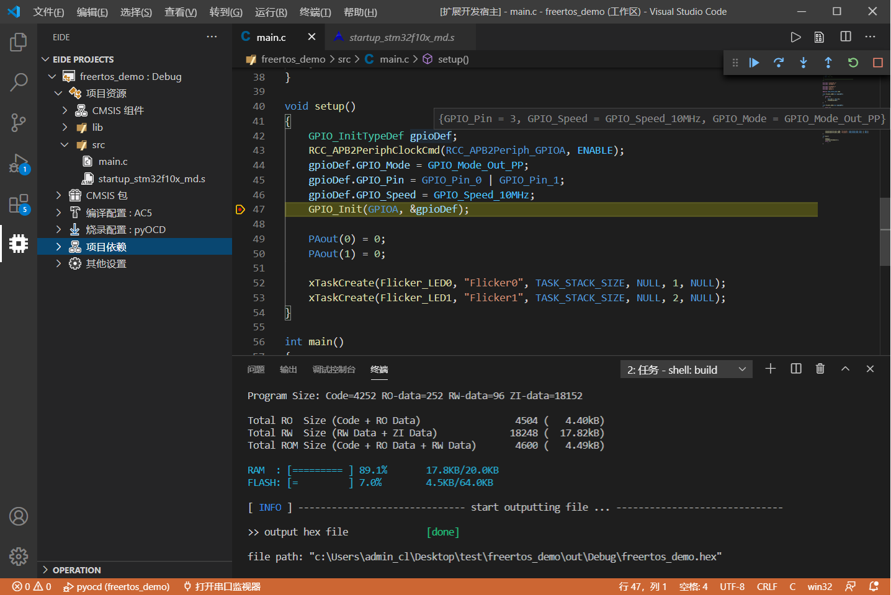

# Embedded IDE

   

***

## [English](./README_EN.md)

## 简述 📑

一个 8051/STM8/Cortex-M 的开发工具。用于在 vscode 上提供对 8051, STM8, Cortex-M 项目进行 开发, 编译, 烧录 的功能。

**仅支持 Windows 平台**

***

## 功能特性 🎉

* 提供丰富的项目模板方便快速开始项目
* 支持从标准的 CMSIS Package 安装芯片的外设库
* 一键编译、快速编译，支持多种主流的编译工具
* 一键烧录到芯片，支持多种主流的烧录器
* 内置的串口监视器
* 为调试器 Cortex-debug / STM8-debug 自动生成调试配置

***

## 工具链支持 🔨

####   

####   

####    

***

## 使用方法 📖

#### 这里有一个简要的 [使用说明](https://blog.csdn.net/qq_40833810/category_9688932.html)

***

## 版本变化 🔔 (最近3次，详见 [CHANGELOG](./CHANGELOG.md))

> #### 遇到了 BUG ? 反馈途径: [Github Issue](https://github.com/github0null/eide/issues)

### [v1.18.3]
- 更改：调整输出目录
- 更改：重命名 dependence 目录
- 更改：调整某些文本提示
- 更改：Build 功能: 使用编译器输出的 *.d 引用文件来确定哪些源文件需要重新编译，移除旧的方法
***

### [v1.18.1]
- 修复：输出目录不存在导致 jlink 烧录失败并无法再次进行烧录
- 更改：使某些输入框能够一直获得焦点，防止因鼠标单击空白而导致输入框消失
- 更改：调整构建工具的输出
***

### [v1.18.0]
- 新增：为编译器输出增加高亮
- 更改：调整默认快捷键
- 更改：使用 jsonc 解析某些带注释的 vsocde 配置
