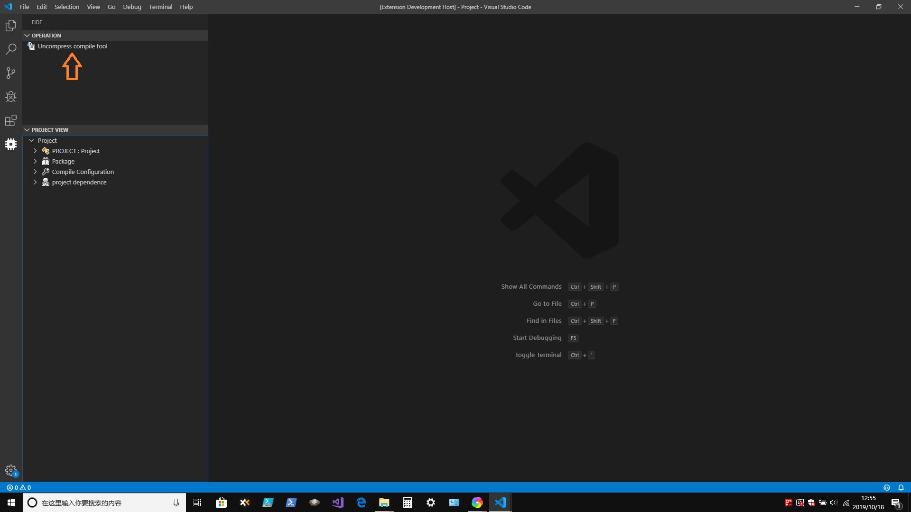
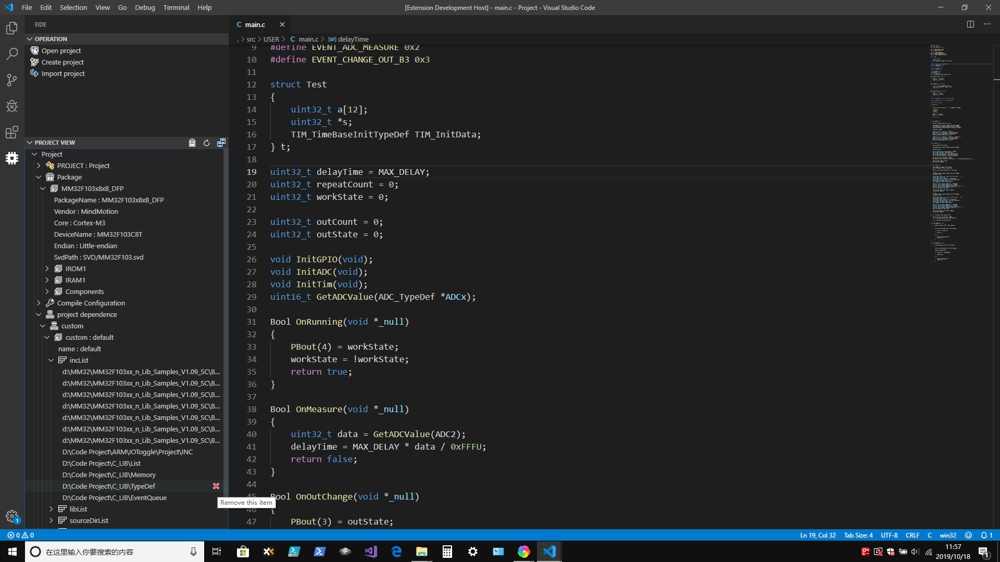
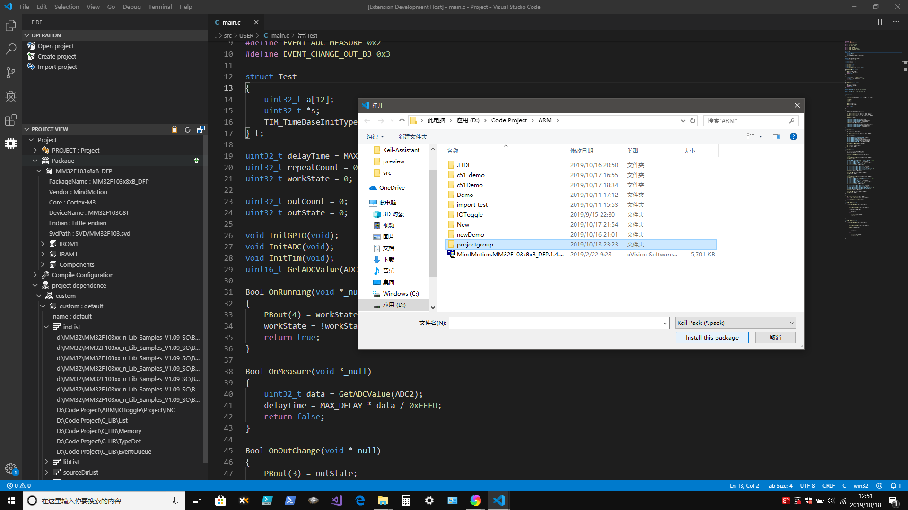
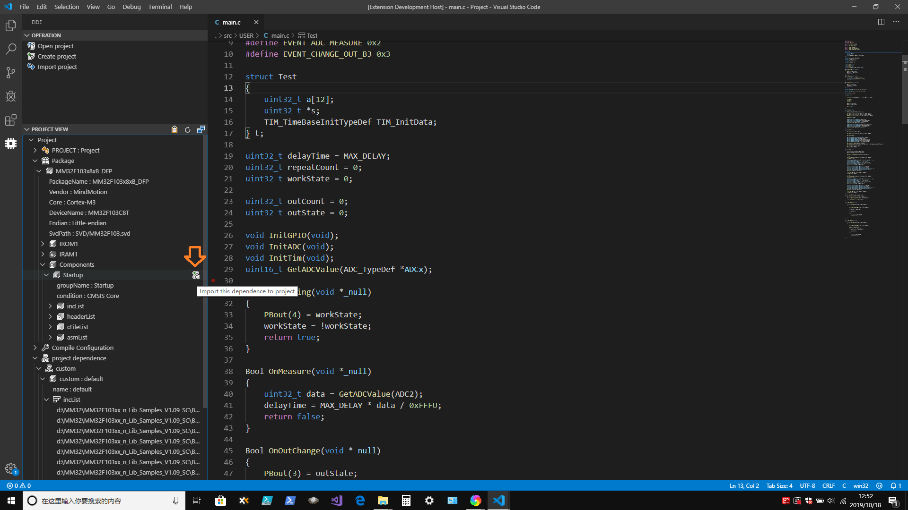
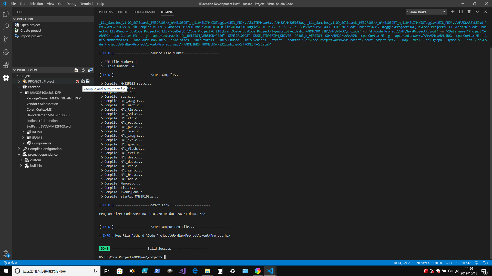

# EIDE

###[跳转至中文](https://github.com/github0null/eide/blob/master/README.md)

## Summary

A tiny IDE for develop STM32 and C51 project on vscode. It is convenient to develop and manage C51 and STM32 projects in vscode. It also supports import and export of Keil uVision 5 projects **Only for Windows platform**

***

## Function

* Open EIDE project
* Create EIDE project
* Import Keil uVision 5 project and create a new EIDE project for it
* Export Keil project file(.uvprojx, .uvproj) to workspace
* Manage project dependence
* Compile project (if it is a STM32 project, it will generate a launch.json for `stm32-debugger` debugger)
* `If you need a STM32 debugger, you can search stm32-debugger in extensions market (It combines with EIDE for a better experience)`

***

## Warnings
  + **Chinese words should not exist in the installation path of the plug-in, otherwise it may fail when using the compile function**
  + **Not support debug for C51 project**

***

## Function Preview

* **You should uncompress compile tool before start a project** 

***

* **Project preview** 

***

* **You can install Keil package for this project (You can also not install it)** 

***

* **You can install project dependence from Keil package (You can also not install it)** 

***

* **Compile project** 

***

* **Start debug (use `stm32-debugger`)** 