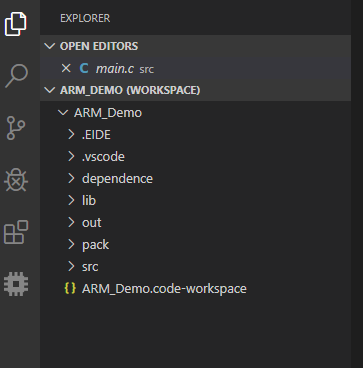
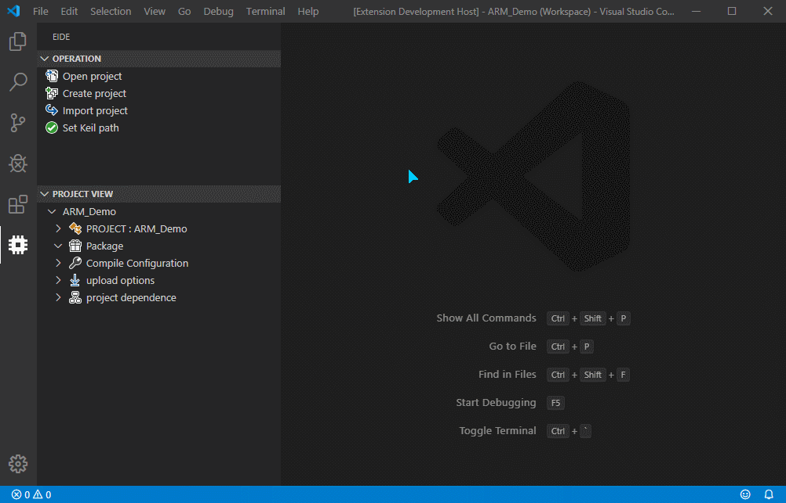
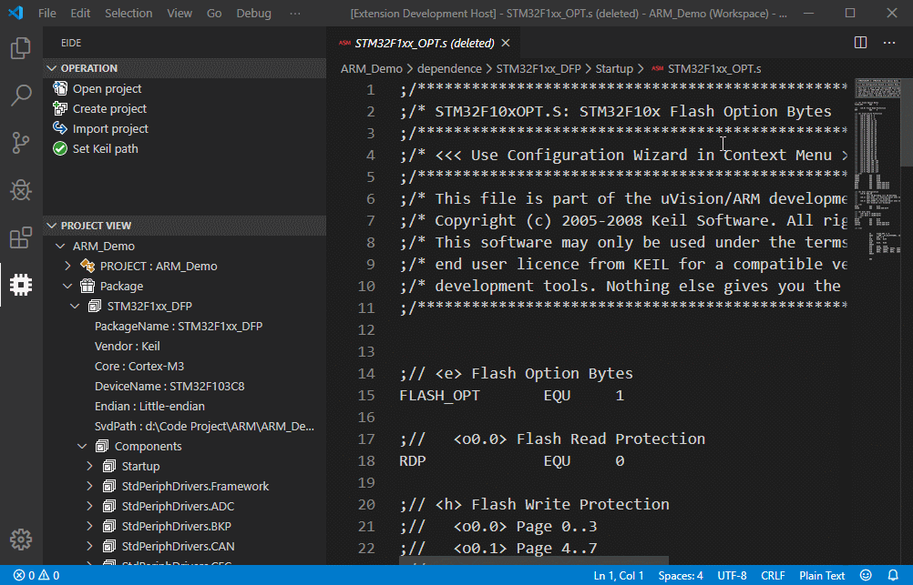
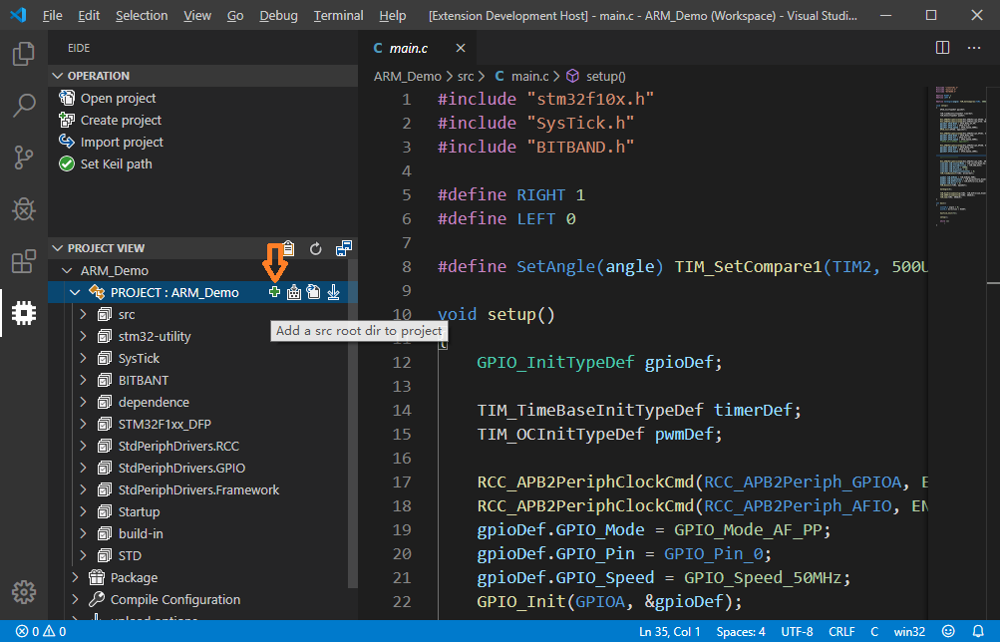
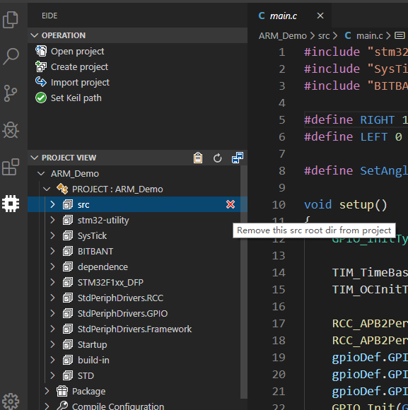

# EIDE 使用手册和注意事项

[toc]

***

### 目录基本结构

- `.EIDE` 项目文件的目录和 EIDE 日志存放的位置
- `dependence` 项目依赖的存放位置, 其中内容由 EIDE 自动添加、创建、管理
- `out` EIDE 默认的输出目录, 编译产生的文件存放在此处
- `pack` ARM 包的安装位置, 用户无需更改此文件夹下的内容
- `src` 源文件的目录, 可以自由选择

> 其他未列出的目录不在 EIDE 的管理范围之内，也不由 EIDE 创建

### 使用方法

#### 打开项目

***
#### 新建项目

***
#### 安装 Keil 包

****
#### 添加 keil Package 中的 Component, 添加完成之后删除不需要的文件

****
#### 编译项目

*** 
#### 导入 Keil uVison 5 项目

***
#### 导出 Keil uVison 5 XML

***
#### 开始调试 (使用 stm32-debugger)

### 其他功能
#### 添加新的源文件目录到搜索列表中

***
#### 将一个源文件目录从搜索列表移除, 操作并不会删除目录

****
#### 添加预编译的宏
